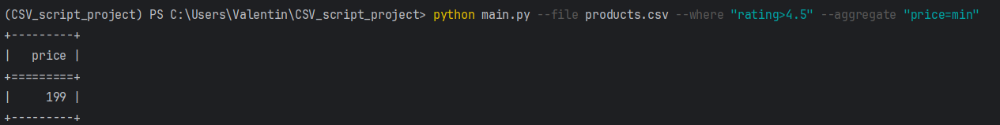
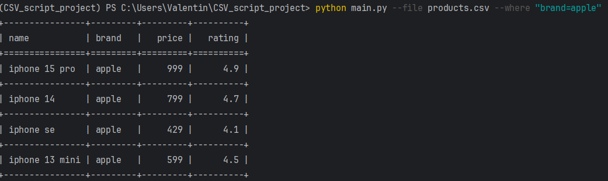
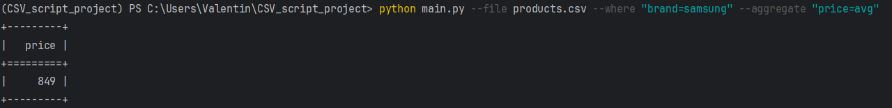
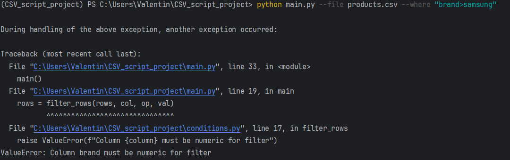
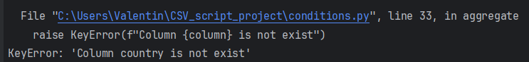
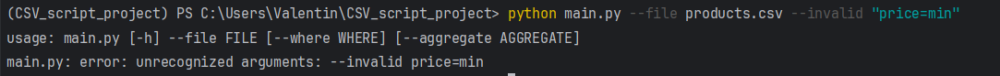

python main.py --file products.csv --where "rating>4.5" --aggregate "price=min"

python main.py --file products.csv --where "brand=apple" 

python main.py --file products.csv --where "brand=samsung" --aggregate "price=avg"

python main.py --file products.csv --where "brand>samsung"

python main.py --file products.csv --aggregate "country=avg" 

python main.py --file products.csv --invalid "price=min" 

Архитектура проекта позволяет легко добавлять новые функции без переработки существующего кода:

Новая агрегация (например, median, sum) добавляется как одна строка в словарь AGG_FUNCTIONS — без изменений логики aggregate().

Новая команда (например, --order-by) добавляется через Parser._configure() и отдельную функцию обработки.